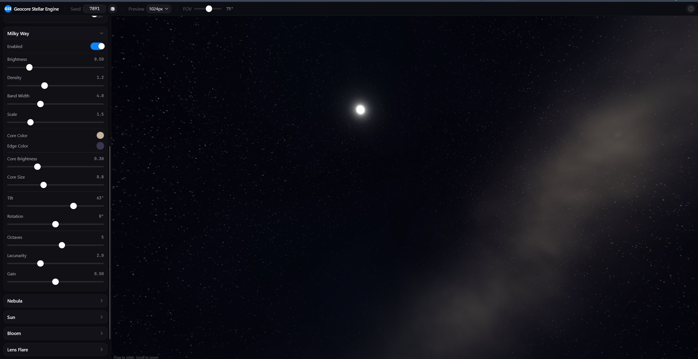
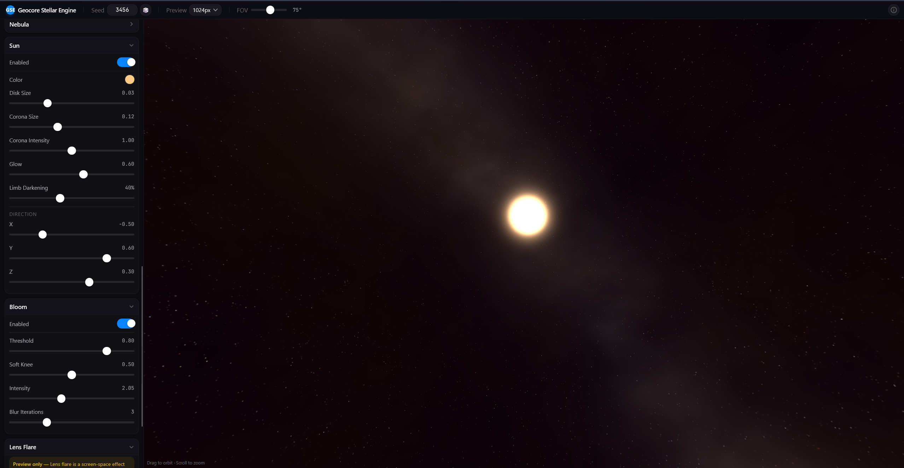
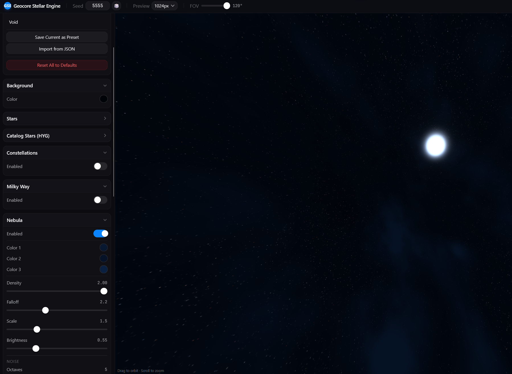

# Geocore Stellar Engine

A GPU-accelerated procedural skybox engine for low-earth orbit simulation. Generate photorealistic space backgrounds — complete with the Milky Way, 100K+ catalog stars, 88 IAU constellations, volumetric nebulae, sun with god rays and lens flare — then export as cubemap PNGs or HDR for Unity and other game engines.

Built for [Geocore](https://geocore.fun) — a 3D modern educational geography game, using a camera perspective from low-earth orbit.

## Links

## Screenshots

|  |  |  |
| :-------------------------------------------------------------------: | :-------------------------------------------------------------------: | :-------------------------------------------------------------------: |

---

## Features

### Render Layers (10 layers)

- **Milky Way** — Physically-based galactic plane with customizable tilt, core brightness, and arm structure
- **Catalog Stars** — 119,614 real stars from the HYG v4.2 database with accurate B-V color mapping and magnitude-based sizing
- **Procedural Stars** — 100K+ seeded point sprites with adjustable count, brightness, size, and color variation
- **Nebula** — Volumetric 4D simplex noise FBM with 3-color gradient, tunable density, falloff, and octaves
- **Sun** — Directional light with disk, corona, limb darkening, and atmospheric glow
- **Constellations** — All 88 IAU constellation lines, labels, and boundary polygons
- **Named Star Labels** — Labels for prominent named stars (Sirius, Betelgeuse, Polaris, etc.)
- **Background** — Solid color fill layer

### Post-Processing Pipeline

- **God Rays** — Volumetric light scattering with radial blur + cross-face analytical glow
- **Bloom** — Multi-pass Gaussian bloom with configurable threshold, soft knee, and iterations
- **Lens Flare** — Analytical ghost elements, halo ring, anamorphic streaks, and chromatic aberration

### Export Formats

- **Individual Face PNGs (ZIP)** — 6 cubemap faces at up to 8K resolution
- **Cross Layout PNG** — Single 4:3 composite image
- **HDR (Radiance RGBE)** — High dynamic range cubemap export
- **Tiled Rendering** — GPU-friendly tile-based rendering for 8K/16K+ exports without VRAM limits
- **Batch Export** — Export all presets in one operation

### Editing & Workflow

- **Preset System** — 5 built-in presets + save/load/import/export custom presets (JSON)
- **Undo/Redo** — Full parameter history with keyboard shortcuts (Ctrl+Z / Ctrl+Shift+Z)
- **A/B Comparison** — Side-by-side before/after comparison with split slider
- **Session Persistence** — Auto-saves all parameters to localStorage; restores on reload
- **Real-time Histogram** — Live RGB histogram with async GPU readback (no stalls)
- **Performance Monitor** — FPS/frame time/render time overlay

### Graphics Engine

- **WebGL2 + GLSL 300 es** — Hardware-accelerated rendering pipeline
- **10-layer compositing** — Sorted render layers with per-layer enable/disable
- **Cubemap FBO** — Renders all 6 faces with shared framebuffer
- **Async Readback** — PBO-based pixel readback with fence sync for stall-free histogram

## Author

[Anahat Mudgal](https://anahatmudgal.com) · [GitHub](https://github.com/anahatm) · [Geocore Technologies](https://github.com/Geocore-fun)
